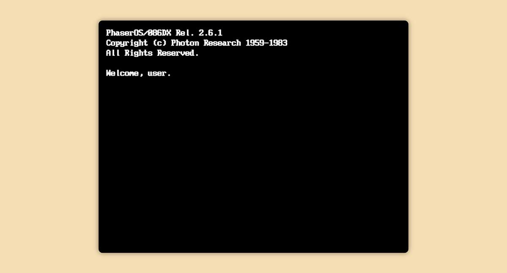

# 👾 Phaser + TypeScript generator

[![Package version][package-image]][package-url]
[![Build status][build-image]][build-url]
[![Coverage status][coverage-image]][coverage-url]
[![Dependency Status][deps-image]][deps-url]

Provides a handy jumpstart for a [Phaser][phaser] project with a
[TypeScript][typescript] codebase.



In addition to a ready-to-code scaffolding, you get
stuff like:

- A fully-functional Phaser project, complete with TypeScript type definitions
- Automated tasks for compiling, bundling, and deploying
- A demo game to get you going
- A [Heroku][heroku] deployment setup

## Requirements

There’s two things you’re gonna want to have installed globally before you run
this generator:

- [Yarn][yarn]
- [Typings][typings]

Of course, you’ll also need [Node.js][nodejs] and [Yeoman][yeoman], but you
already knew that, yeah?

## Installation

    $ yarn global add generator-phaser-ts

That’s it.

### Caveats

If the above installation command yields unsatisfactory results, give npm a crack
at it, i.e. `npm i -g generator-phaser-ts`.

If Yarn yells at you about the installation of anything, you may need to install
the current stable version, (at the time of writing) 0.16.1. If you’re using
Homebrew, you’ll need to make sure you’ve checked out the proper version of the
Yarn formula. In my case, this did the trick:

``` shell
$ cd /usr/local/Homebrew/Library/Taps/homebrew/homebrew-core/Formula/
$ git checkout ca1c753c6df92e46962c14b01e597c60fc299c5c yarn.rb
$ brew install yarn
$ git checkout HEAD yarn.rb
```

## Usage

    $ yo phaser-ts
    
This gets a project scaffolded out, installs software requirements, and does
an initial build of the included demo game.

**PRO TIP:** Create a new directory for your game and `cd` to it before running
the generator.

## Development

This project uses [gulp][gulp] to automate various common development tasks. While
you can interact with gulp directly, the generator gives you access to some scripts
that should cover your day-to-day needs.:

- `gulp lint`: Processes all .ts files in the src directory with `tslint` and
  displays the results
- `gulp build`: Compiles all .ts files in the src directory; outputs .js files
  to the build directory
- `gulp bundle`: Concatenates all .js files in the build and lib directories
  into a single file: public/js/bundle.js
- `gulp compress`: Uglifies the bundled .js file; outputs public/js/bundle.min.js
- `gulp watch`: Watches for changes to source files; when a change is detected,
  rebuilds files and reloads the website.
- `gulp deploy`: Deploys to Heroku. See below.
- `gulp`: The default gulp task. Runs the `bundle` task.

For convenience, this project includes a basic Node.js application that serves
up your game courtesy of the [Express][express] framework. To start the Express
server, run `yarn server`. You should now be able to see your game running at
[http://localhost:3000](http://localhost:3000).

If you would like to run the server as well as rebuild your files upon save, i.e.
what you’ll be doing most of the time, run `yarn devel`.

**PRO TIP:** If you want to run the server but *not* rebuild files upon save, set
the `LIVERELOAD` environment variable to `0`: `LIVERELOAD=0 yarn devel`.

## Deployment

Included is a Heroku-compatible [Procfile][heroku-procfile] so—assuming
you have the [Heroku Command Line Interface][heroku-cli] installed and you’re logged
in—getting your game up on them internets should be as simple as:

    $ yarn deploy

**PRO TIP:** You can `yarn production` to locally serve your game using minified code.

## Contributing

Please note that this an opinionated tool based on my particular preferences.
That being said, all pull requests are welcome!

## Licenses

This project is ISC © Nicholas Scheurich.<br>
*Phaser* is MIT © Richard Davey, Photon Storm Ltd.<br>
PC font is CC BY-SA 4.0 from INT10h.org.

[phaser]: http://phaser.io/
[typescript]: https://www.typescriptlang.org/
[nodejs]: https://nodejs.org/en/
[typings]: https://github.com/typings/typings
[gulp]: http://gulpjs.com/
[express]: https://expressjs.com/
[heroku]: https://www.heroku.com/
[heroku-procfile]: https://devcenter.heroku.com/articles/procfile
[heroku-cli]: https://devcenter.heroku.com/articles/heroku-command-line
[yeoman]: http://yeoman.io/
[yarn]: https://yarnpkg.com/
[package-image]: https://badge.fury.io/js/generator-phaser-ts.svg
[package-url]: https://npmjs.org/package/generator-phaser-ts
[build-image]: https://travis-ci.org/ngscheurich/generator-phaser-ts.svg?branch=master
[build-url]: https://travis-ci.org/ngscheurich/generator-phaser-ts
[coverage-image]: https://coveralls.io/repos/github/ngscheurich/generator-phaser-ts/badge.svg?branch=master
[coverage-url]: https://coveralls.io/github/ngscheurich/generator-phaser-ts?branch=master
[deps-image]: https://david-dm.org/ngscheurich/generator-phaser-ts.svg?theme=shields.io
[deps-url]: https://david-dm.org/ngscheurich/generator-phaser-ts
